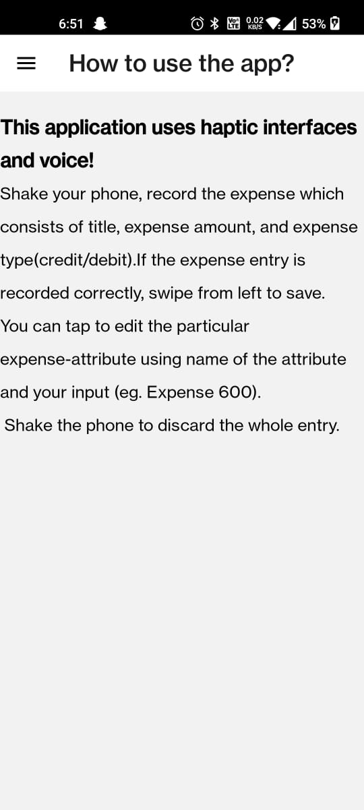
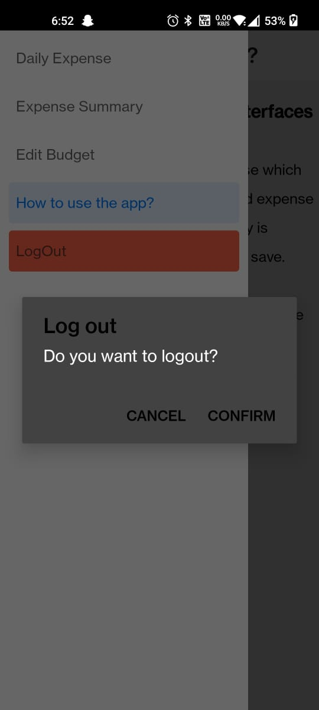
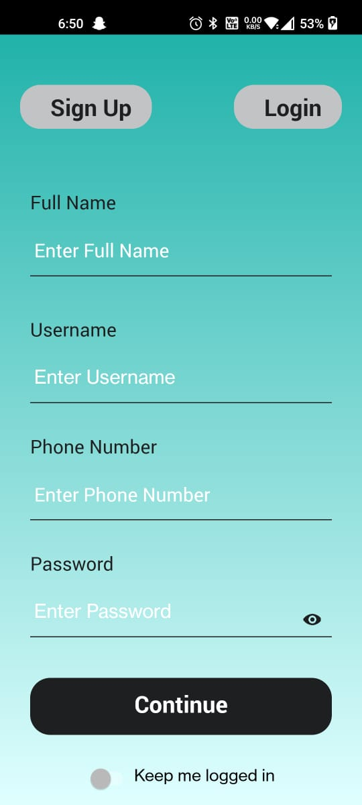
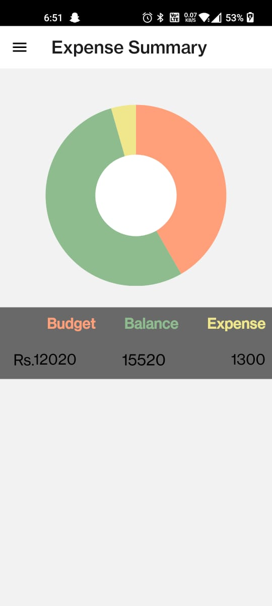

# MoneyMap - EXPERIMENTS IN FUSING SPEECH AND HAPTIC INTERFACES
MoneyMap is a react-native budget tracker. The motive to use voice is to make it handy and time saving. It also includes hand gestures to perform the CRUD operations which enhance the user experience. Expo-sensors library is used to fetch device accelerometer data and enable gesture-based features. To record the user expense I have used [Vosk](https://alphacephei.com/vosk/models) english model. This converts speech to text. Backend REST APIs use Swagger and Node.js for user management, CRUD operations.

## The application consists of following screens:
- Use signup and/or login screen to enter in the application.
- Home screen -> Shake your phone so that recording starts. Enter your expense entry which must include expense title, amount and expense type.
- Modal -> A new UI gets displayed which shows the categorization of your expense entry. If you find all the fields correct, you can use swipe gesture to save your expense.
- If there is some error in a particular field, we can tap and record the new corrected entry.
- To discard the entry, just shake your phone. This will get back you to the main screen.
- Summary screen shows the comparison statistics of balance, budget and expense.
- Application guide screen helps to understand the working of application.
- Logout screen

## Following are the screenshots of application:
 

